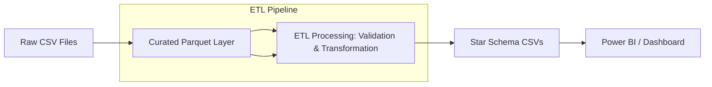

# Finance ETL Pipeline
*(Monthly Close Dataset)*

<p align="center">
  <a href="https://github.com/Chezhira/Finance-ETL-Pipeline-Monthly-Close-Dataset-">
    
  </a>
  https://img.shields.io/badge/Chez%20Solutions-Project-blue?style=flat-square
  https://img.shields.io/badge/Python-3.10%20|%203.11%20|%203.12-blue?logo=python
  LICENSEhttps://img.shields.io/badge/License-MIT-green.svg</a>
  https://github.com/astral-sh/ruffhttps://img.shields.io/badge/Lint-Ruff-4B8BBE?logo=python</a>
  https://github.com/psf/blackhttps://img.shields.io/badge/Format-Black-000000</a>
  https://pre-commit.com/https://img.shields.io/badge/hooks-pre--commit-FFB000?logo=pre-commit</a>
</p>

---

## 🌟 Project Highlights
- ✅ **Portfolio-grade ETL pipeline** for monthly financial close.
- ✅ **Validated, curated Parquet datasets** for dashboards and FP&A.
- ✅ **Star-schema outputs** for BI tools (Power BI, Tableau).
- ✅ **Built-in data quality checks** and KPI calculations.
- ✅ **CI/CD with linting, formatting, tests, and security audit**.
- ✅ **Pre-commit hooks** to keep code clean locally.
- ✅ **Modern Python tooling**: Ruff, Black, pytest, GitHub Actions.

---

## 📌 Overview
A **data engineering mini-project** that turns messy monthly finance extracts into **validated, curated datasets** ready for analytics.

---

## 🏗 Architecture



---

## 🔄 CI/CD Workflow

*(Details of GitHub Actions workflow go here)*

---

## 🚀 Quickstart

```bash
# Clone repo
git clone https://github.com/Chezhira/Finance-ETL-Pipeline-Monthly-Close-Dataset.git
cd Finance-ETL-Pipeline-Monthly-Close-Dataset

# Install dependencies
pip install -e .
pip install -r requirements-dev.txt

# Generate synthetic data
python scripts/generate_synthetic_data.py --month 2025-12 --out-dir data/raw

# Run ETL pipeline
finance-etl run --month 2025-12
```

---

## 📜 Data Contracts

* **fact_transactions.parquet** → GL transactions
* **dim_accounts.parquet** → Chart of accounts
* **kpi_monthly.parquet** → KPI metrics

---

## ✅ Data Quality Controls

* Null checks
* Referential integrity (entity/account keys)
* KPI consistency checks

---

## 📊 Outputs & KPIs

* **Star schema CSVs:** `dim_date.csv`, `dim_month.csv`, `dim_entity.csv`, `dim_account.csv`, `fact_gl.csv`, `fact_kpi_monthly.csv`
* KPIs: Revenue, Expense, Gross Margin %, Operating Margin %

---

## 🤝 Contributing

Pull requests are welcome!Run `pre-commit run --all-files` before committing to keep CI green.

---

## 📄 License

MIT License © 2026 Chez Solutions
